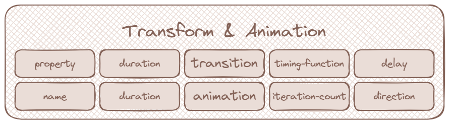

# The Property Organization Ritual

<figure><figcaption><p>The Sacred Order of Mystical Categories</p></figcaption></figure>

## The Ancient Knowledge

Proper organization of mystical properties within selectors is a fundamental practice of CSS sorcery. By following the sacred order established by the ancient masters, your spells become more readable, maintainable, and powerful. This ritual ensures that your styling enchantments flow in harmony with the natural order of element manifestation.

## The Seven Sacred Steps

### Step 1: Dimensional Enchantments

<figure><figcaption><p>Dimensional Enchantment Properties</p></figcaption></figure>

Dimensional enchantments control the mystical size boundaries of elements, defining their width, height, and the sacred limits of their spatial manifestation.

#### Width Spells
- `width`: Defines the element's mystical width
- `min-width`: Sets the minimum width boundary
- `max-width`: Establishes the maximum width constraint

#### Height Incantations
- `height`: Determines the element's mystical height
- `min-height`: Sets the minimum height boundary
- `max-height`: Establishes the maximum height constraint

#### Mystical Code Example

```css
.element {
    /* Dimension Properties */
    width: 500px;
    min-width: 400px;
    max-width: 600px;
    height: 300px;
    min-height: 200px;
    max-height: 400px;
}
```

### Step 2: Spatial Positioning Enchantments

<figure><figcaption><p>Spatial Positioning Properties</p></figcaption></figure>

Spatial positioning enchantments control how elements are positioned and manifested within their mystical container realm.

#### Position Spells
- `position`: Defines the positioning method (static, relative, absolute, fixed, sticky)
- `top`, `right`, `bottom`, `left`: Sets the spatial offset coordinates
- `z-index`: Controls the dimensional stacking order

#### Display and Float Incantations
- `display`: Controls how the element manifests in the layout flow
- `float`: Levitates the element to the left or right
- `clear`: Controls which sides repel other floating elements
- `visibility`: Controls element visibility in the mystical plane

#### Mystical Code Example

```css
.element {
    /* Placement Properties */
    position: relative;
    top: 10px;
    left: 20px;
    z-index: 100;
    display: block;
    float: left;
    visibility: visible;
}
```

### Step 3: Mystical Box Model Enchantments

<figure><figcaption><p>Mystical Box Model Properties</p></figcaption></figure>

Box model enchantments control the sacred spacing and protective barriers around elements, defining their mystical boundaries.

#### Margin Spells
- `margin`: Sets all outer mystical spacing
- `margin-top`, `margin-right`, `margin-bottom`, `margin-left`: Individual margin enchantments

#### Padding Incantations
- `padding`: Sets all inner mystical spacing
- `padding-top`, `padding-right`, `padding-bottom`, `padding-left`: Individual padding spells

#### Border Protective Barriers
- `border`: Sets all border protective properties
- `border-width`, `border-style`, `border-color`: Individual border enchantments
- `border-radius`: Rounds the mystical corners with gentle curves

#### Mystical Code Example

```css
.element {
    /* Box Model Properties */
    margin: 20px;
    margin-top: 10px;
    padding: 15px;
    padding-left: 20px;
    border: 2px solid #333;
    border-radius: 8px;
}
```

### Step 4: Visual Manifestation Enchantments

<figure><figcaption><p>Visual Manifestation Properties</p></figcaption></figure>

Visual manifestation enchantments control the mystical appearance of elements including colors, backgrounds, and shadow effects that bring elements to life.

#### Background Spells
- `background`: Master spell for all background enchantments
- `background-color`: Sets the mystical background hue
- `background-image`: Conjures background imagery
- `background-size`: Controls the scale of background manifestations

#### Color and Shadow Incantations
- `color`: Sets the mystical text hue
- `opacity`: Controls element transparency in the ethereal plane
- `box-shadow`: Casts shadow effects around elements
- `text-shadow`: Weaves shadow magic around text

#### Mystical Code Example

```css
.element {
    /* Appearance Properties */
    background-color: #f0f0f0;
    background-image: url('pattern.png');
    background-size: cover;
    color: #333;
    opacity: 0.9;
    box-shadow: 0 4px 8px rgba(0, 0, 0, 0.1);
}
```

### Step 5: Typography Enchantments

<figure><figcaption><p>Typography Enchantment Properties</p></figcaption></figure>

Typography enchantments control the mystical appearance and flow of textual content, shaping how words manifest on the page.

#### Font Spells
- `font-family`: Selects the mystical font lineage
- `font-size`: Determines the scale of textual manifestation
- `font-weight`: Controls the thickness of character strokes (bold, normal, etc.)
- `font-style`: Sets the character inclination (italic, normal, etc.)

#### Text Flow Incantations
- `text-align`: Controls the alignment of textual energy
- `text-decoration`: Adds mystical text embellishments (underline, etc.)
- `line-height`: Sets the vertical spacing between text lines
- `letter-spacing`: Controls the mystical spacing between individual characters

#### Mystical Code Example

```css
.element {
    /* Font and Text Properties */
    font-family: 'Arial', sans-serif;
    font-size: 16px;
    font-weight: 600;
    font-style: normal;
    text-align: center;
    text-decoration: none;
    line-height: 1.5;
    letter-spacing: 0.5px;
}
```

### Step 6: Motion and Transformation Enchantments

<figure><figcaption><p>Motion and Transformation Properties</p></figcaption></figure>

Motion and transformation enchantments control element metamorphosis and temporal animations, bringing life and movement to static elements.

#### Transformation Spells
- `transform`: Applies 2D or 3D spatial transformations
- `transform-origin`: Sets the mystical pivot point for transformations
- `transform-style`: Controls how nested elements render in 3D mystical space

#### Animation Incantations
- `animation`: Master spell for all animation enchantments
- `transition`: Controls smooth metamorphosis between property states
- `animation-duration`: Sets the temporal length of animations
- `animation-timing-function`: Controls the mystical timing rhythm

#### Mystical Code Example

```css
.element {
    /* Transform and Animation Properties */
    transform: translateX(10px) rotate(45deg);
    transform-origin: center;
    transition: all 0.3s ease-in-out;
    animation: slideIn 1s ease-out;
}
```

### Step 7: Auxiliary Mystical Properties

<figure><figcaption><p>Auxiliary Mystical Properties</p></figcaption></figure>

Auxiliary mystical properties encompass various other enchantments that don't fit into the primary categories but provide essential interactive and behavioral magic.

#### Cursor and Interaction Spells
- `cursor`: Transforms the mouse cursor appearance
- `pointer-events`: Controls how elements respond to mystical pointer interactions
- `user-select`: Controls text selection behavior in the user realm

#### Overflow and Clipping Incantations
- `overflow`: Controls content overflow behavior beyond boundaries
- `overflow-x`, `overflow-y`: Controls horizontal and vertical overflow separately
- `clip-path`: Creates mystical clipping regions to hide portions of elements

#### Mystical Code Example

```css
.element {
    /* Miscellaneous Properties */
    cursor: pointer;
    pointer-events: auto;
    user-select: none;
    overflow: hidden;
    clip-path: circle(50%);
}
```

## The Complete Ritual Manifestation

Behold, a comprehensive example demonstrating all mystical property categories organized in perfect harmony according to the ancient order:

```css
.perfectly-organized-element {
    /* 1. Dimensional Enchantments */
    width: 500px;
    min-width: 400px;
    max-width: 600px;
    height: 300px;
    min-height: 200px;
    max-height: 400px;

    /* 2. Spatial Positioning Enchantments */
    position: relative;
    top: 10px;
    left: 20px;
    z-index: 100;
    display: block;
    float: none;
    visibility: visible;

    /* 3. Mystical Box Model Enchantments */
    margin: 20px;
    margin-bottom: 30px;
    padding: 15px;
    padding-left: 25px;
    border: 2px solid #333;
    border-radius: 8px;

    /* 4. Visual Manifestation Enchantments */
    background-color: #f8f9fa;
    background-image: linear-gradient(135deg, #667eea 0%, #764ba2 100%);
    background-size: cover;
    color: #333;
    opacity: 0.95;
    box-shadow: 0 4px 12px rgba(0, 0, 0, 0.15);

    /* 5. Typography Enchantments */
    font-family: 'Inter', -apple-system, sans-serif;
    font-size: 16px;
    font-weight: 500;
    font-style: normal;
    text-align: center;
    text-decoration: none;
    line-height: 1.6;
    letter-spacing: 0.025em;

    /* 6. Motion and Transformation Enchantments */
    transform: translateY(-2px);
    transform-origin: center;
    transition: all 0.3s cubic-bezier(0.4, 0, 0.2, 1);
    animation: fadeInUp 0.6s ease-out;

    /* 7. Auxiliary Mystical Properties */
    cursor: pointer;
    pointer-events: auto;
    user-select: none;
    overflow: hidden;
}
```

## Sacred Texts & Mystical Sources


