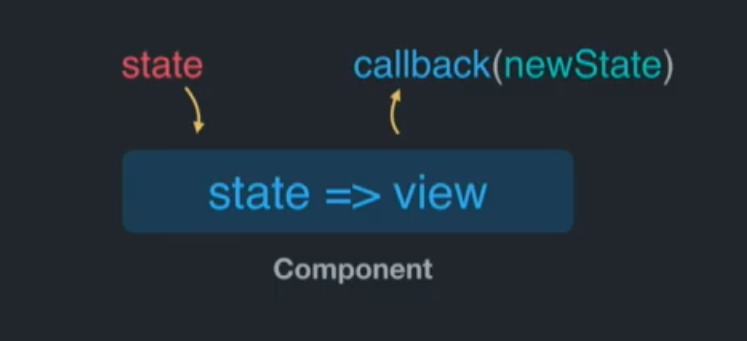

# State

## What is State ?

### Types of State

* Local State
* Shared State
* Remote State
* Meta State
* Router State

### Mental Model



### Local State

* Component State
* Form State (local copy)
* UI State (local concern)

### Shared State

* App State
* Data (cache or store)
* UI State (shared concer)

#### Local State => Shared State

> Two or more components need to **access** or **manipulate** the same piece of state, but should have no **knowledge of each other.**

#### Props => Context

> **Interstitial components** that shouldn't know about a prop explicitly accept it, exclusively to **pass it on to their children.**

### Remote State

* You don't own it
* You may cache it or derive other values from it
* You have an API to sync local changes to it
* Always async and not infallible (be guarded)

### Meta State / Router State

* Provided for you; you aren't the source of truth
* You have an API to request it changes
* Always respect it (purity)
* Not part of remote state, but often coupled to it

## How to manage State ?


Shared mutable state is the <mark style="color:red;">**root of all evil**</mark>



Complex applications thrives on <mark style="color:blue;">**shared mutable state**</mark>


### Apollo


Apollo is an excelent exemple of shared mutable state and the managed really well

### Redux


Evenrything is concidered as shared data&#x20;

### React API

* useState()
* useReducer()
* useContext()

### What's better ?

* You select the data that you want, and don't have to transform it when you get it
* Data requirements are now co-located with the components that need them
* Meta state is handled for you automatically

## Exemple

```javascript
const { params } = useRouter(); //Router State
const { shared } = useContext(); //Shared State
const [ state, send ] = useMachine(); // Complexe Shared State
const [ value, setValue ] = useState(); //Local State
const form = useFormik(); //Local Form State
const { data, error, loading } = useQuery(); //Remote Stata & Meta State
```
